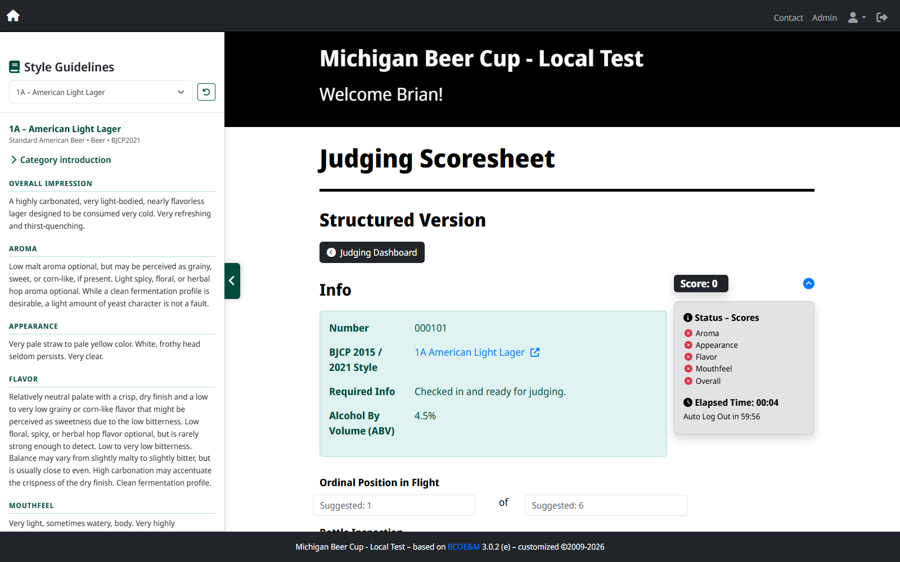
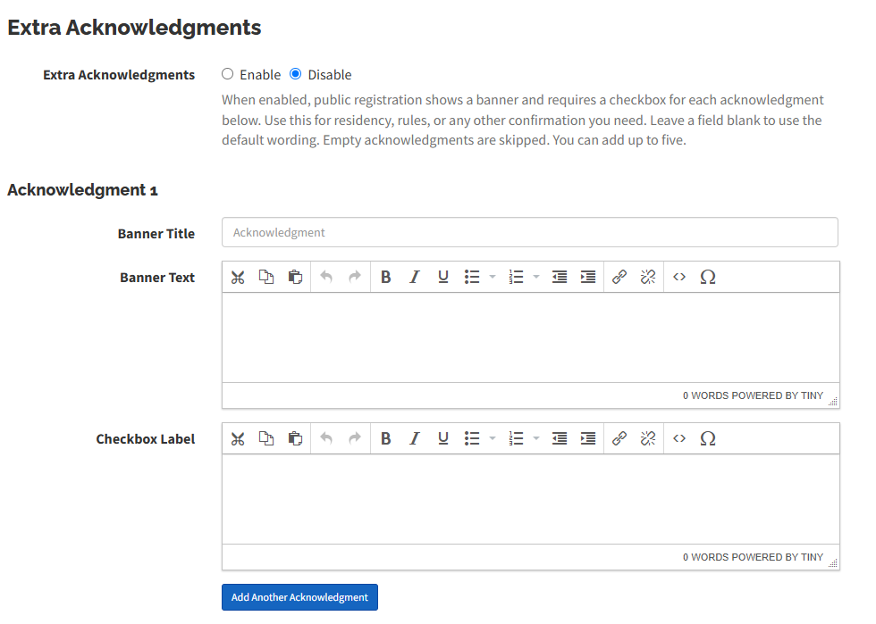
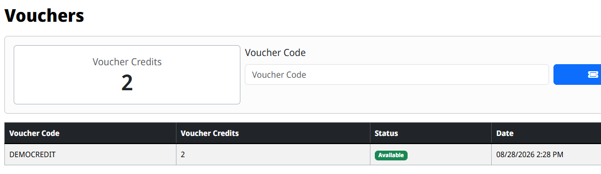
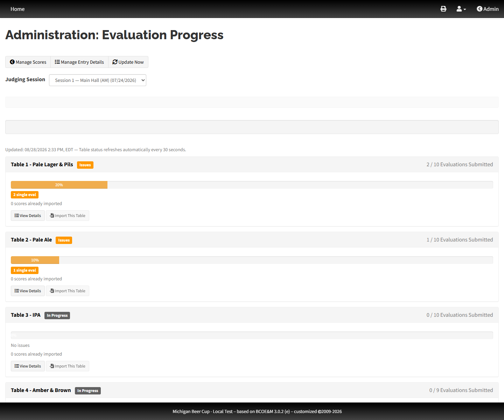
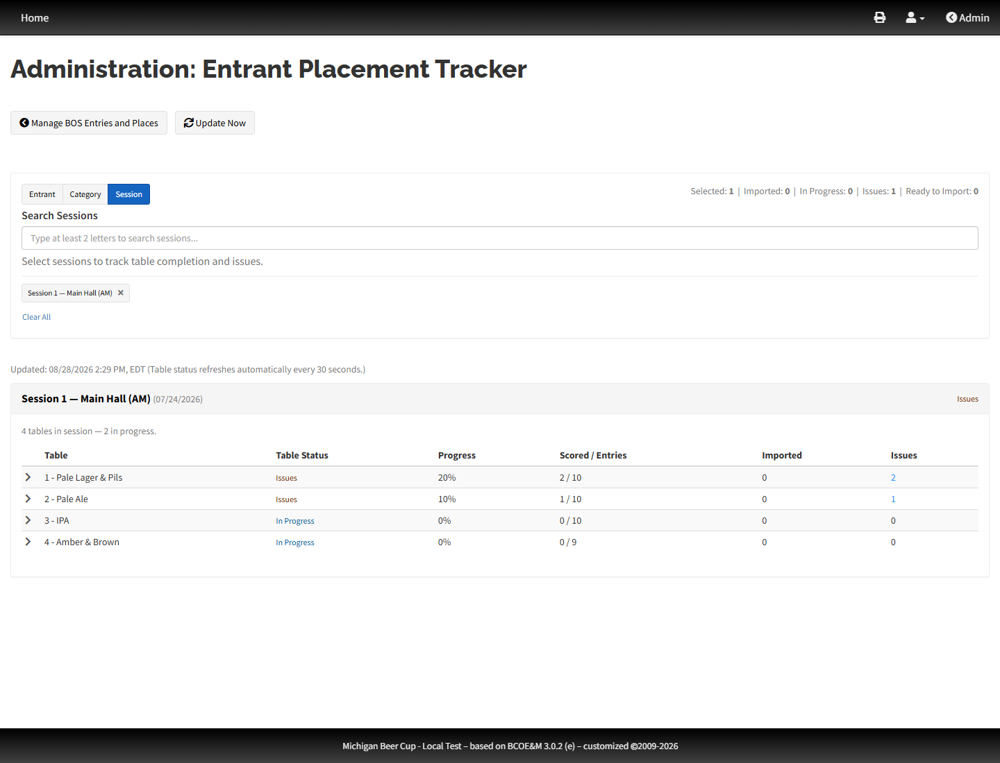
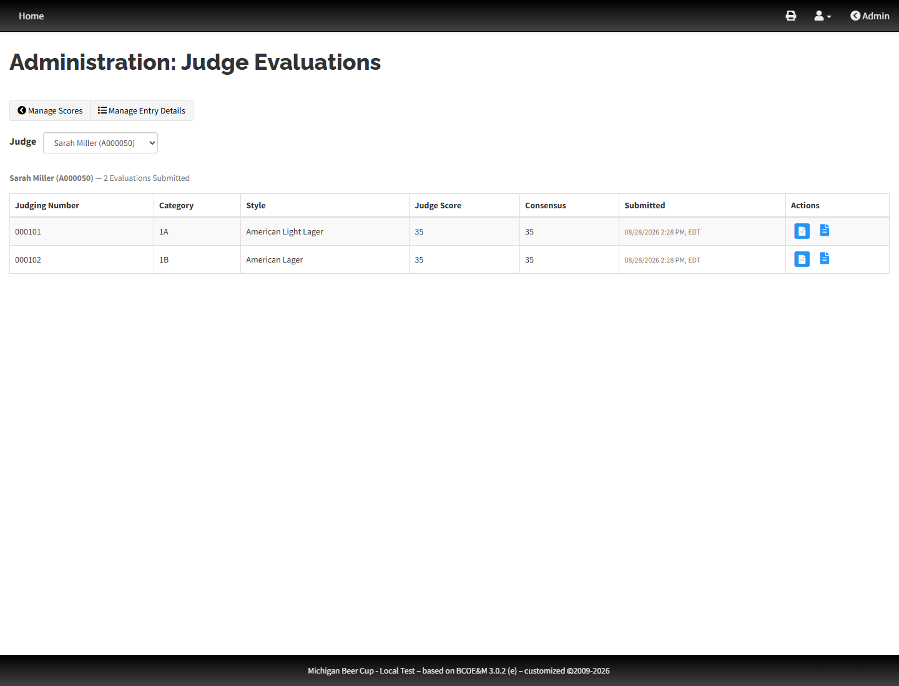
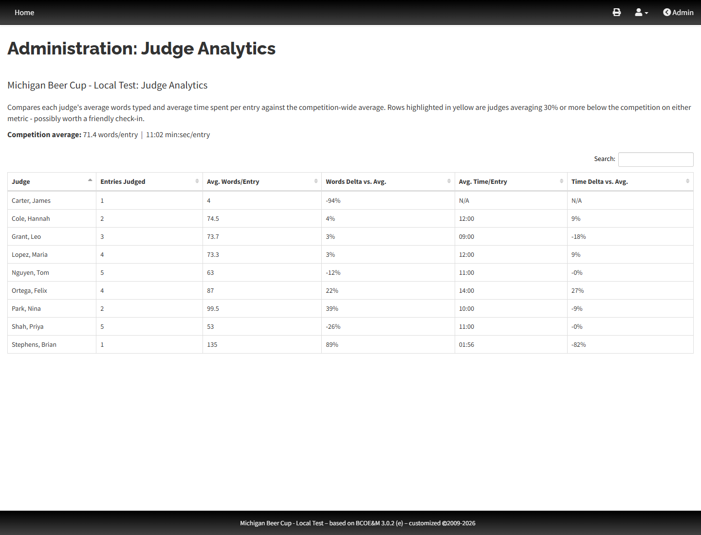

# Brew Competition Online Entry & Management

### Please check the _[Good to Know](https://github.com/geoffhumphrey/brewcompetitiononlineentry/issues?q=is%3Aissue+label%3A%22good+to+know%21%22)_ list before posting any issue. ###

---

Working repository of BCOE&M.

Website: https://www.brewingcompetitions.com
Helpful Articles:
 - [License](https://info.brewingcompetitions.com/license)
 - [Release Notes](https://info.brewingcompetitions.com/release-notes)
 - [Installation Instructions](https://info.brewingcompetitions.com/install-instructions)
 - [Upgrade Instructions](https://info.brewingcompetitions.com/upgrade-instructions)

The Brew Competition Online Entry and Management (BCOE&M) system is an online application to assist homebrew competition organizers - of the beer/mead/cider variety - to collect, store, and manage their competition entry, organization, and scoring data.

The biggest challenges of organizing a homebrewing competition is knowing who has entered what and how many, organizing judging efficiently, and reporting the results of the competition in a timely manner. BCOE&M provides a single online interface to collect entry and participant data, organize judging tables and assignments, input scoring data, and report the results. Features include, but certainly aren't limited to:
- Collecting entry information from participants.
- Four major style guideline collections to use: BJCP 2021, BJCP 2015, Brewers Association (BA), Australian Amateur Brewing Championship (AABC).
- Defining categories and styles customized to your competition's needs.
- Facilitating online entry fee payments (via PayPal).
- Organizing and assigning participants as judges, stewards, and staff.
- Defining tables/flights and assigning judges and stewards to them.
- Mobile entry check-in using [QR and/or barcodes](https://info.brewingcompetitions.com/barcode-check-in).
- [Electronic scoresheets](https://info.brewingcompetitions.com/setup-electronic-scoresheets) for use in [virtual](https://brewingcompetitions.com/virtual-judging) and/or in-person [judging](https://brewingcompetitions.com/judging-with-electronic-scoresheets).
- Scoresheet [upload](https://info.brewingcompetitions.com/upload-scoresheets).
- 60+ reports for use before, during, and after judging.
- 20+ data export options.
- Custom modules for information/functionality unique to your competition.

The best part: **BCOE&M is free and open-source**. Hundreds of competitions around the world have utilized BCOE&M since its [first release](https://brewingcompetitions.com/change-log) back in 2009.

This repository is a fork of that project. It started as the competition site for Michigan Beer Cup and ran the 2026 competition. It is a general BCOE&M fork with quality of life updates, based on BCOE&M 3.0.2. Original software: [brewingcompetitions.com](https://www.brewingcompetitions.com) and [geoffhumphrey/brewcompetitiononlineentry](https://github.com/geoffhumphrey/brewcompetitiononlineentry).

This is an unofficial fork. It is not affiliated with, endorsed by, or supported by Geoff Humphrey or brewingcompetitions.com. The original authors have no obligation to help with this copy. The software is provided as-is, without warranty of any kind. Use it at your own risk, and keep backups before you install or upgrade. Questions about stock BCOE&M belong on the [original project](https://github.com/geoffhumphrey/brewcompetitiononlineentry). Changes that exist only in this fork should stay here.

## Download
This fork is published as **[brewcompetitiononlineentry-plus](https://github.com/brian-stephens/brewcompetitiononlineentry-plus)**. Grab a zip from this repository's [Releases](https://github.com/brian-stephens/brewcompetitiononlineentry-plus/releases) page. Stock BCOE&M zips remain on [Geoff Humphrey's Releases](https://github.com/geoffhumphrey/brewcompetitiononlineentry/releases).

## Install or Upgrade
Use the **Fresh install** steps below. Stock BCOE&M [installation](https://info.brewingcompetitions.com/install-instructions) and [upgrade](https://info.brewingcompetitions.com/upgrade-instructions) notes still apply for hosting and PHP/MySQL requirements.

## This fork

This is a general-purpose fork of BCOE&M. Same application, with quality of life updates for judging, check-in, and admin. Stock docs are above. What we added or changed is below.

Most of the extras can be switched on or off in the usual admin screens. New toggles start off unless you turn them on. Track Judge Analytics is the exception; that one starts on.

### Admin options

**Vouchers** are under Site Preferences, General. Off by default. When on, admins can issue codes and participants can redeem them toward entry fees on their account page. Turn it off and the screens go away, but existing codes stay in the database.

**Eval Admin Tools** are under Judging Preferences, next to Electronic Scoresheets. Off by default. This is Progress Overview, Entrant Tracker, and Judge View only. Manage Entry Evaluations and the judge scoresheets still follow the regular Electronic Scoresheets setting.

**Track Judge Analytics** is also on Judging Preferences. On by default. Judges see average words and time per entry on their dashboard. Admins get a Judge Analytics report under Scoring.

**Extra Acknowledgments** are on Edit Competition Info, after Volunteer Information. Look for the heading on that form. It is not a separate dashboard item. Off by default. When on, you can add up to five custom banners and required checkboxes on public registration, for rules, eligibility, or anything else people should confirm before they create an account. Leave a field blank to use the default wording. Empty items are skipped. Accounts created by an admin do not have to check the boxes.

**Early scoresheets** are under Site Preferences as Display Scores & Scoresheets. There is also a Release Scores Now button on the admin dashboard once judging has started. Logged-in participants can then open their own scores and electronic scoresheets before public winners go out. Places and the public results page stay hidden until Results Display.

### Hidden sessions

**Hidden sessions** are on Add/Edit Judging Location. Check Hide from Front End. That session stays off the public calendar, Entry Info, and volunteer signup, so it does not keep the site in a public "judging is open" state. Admins still assign tables and judges in the backend. Assigned judges still see it on their dashboard and can score it, including after overall judging has closed. Mark Complete when the session is done so it drops off judge dashboards.

### Electronic evaluations

**Style Guidelines** sit on every electronic scoresheet once Electronic Scoresheets are on. Judges get a Style Guide tab that opens BJCP text next to the form: aroma, flavor, mouthfeel, vitals, commercial examples, and the rest. The panel starts on the entry's style. Search picks another style without leaving the scoresheet; the reset button brings the original back. Beer uses BJCP 2021, mead uses BJCP 2015, cider uses BJCP 2025. On a wide screen the panel stays beside the scoresheet so it does not cover the scores. On a phone it slides up from the bottom.

### Screenshots

Style Guidelines on an electronic scoresheet:

Extra Acknowledgments on Edit Competition Info:

Vouchers in Site Preferences:

Voucher redemption on a participant account:

Eval Admin Tools on Judging Preferences:

Progress Overview:

Entrant Tracker:

Judge View:

Judge Analytics report:

### Other changes from stock BCOE&M

Judging and scoresheets:

- Session and category views on evaluation progress
- Judges can open scoresheets 60 minutes before a session starts (stock is 30)
- Consensus scoring on electronic scoresheets
- Multiple honorable mentions on awards displays
- Pull sheet formatting tweaks

Admin and check-in:

- Shared box numbers and expanded barcode check-in
- Bottle labels only print for paid entries
- Labels can still print after close
- Table add/edit stays in the sticky total so you do not lose your place
- Location filter for judging
- Expand or collapse assigned judge and steward names on the judging tables list

### Fresh install

Browser setup is the supported path.

1. Set up PHP and MySQL/MariaDB, then create an empty database.
2. Copy `site/config.sample.php` to `site/config.php`.
3. Fill in DB credentials, `$prefix` (empty string for a dedicated database), `$installation_id`, and `$sub_directory` if the app is not at the domain root.
4. Set `$setup_free_access = TRUE` in `site/config.php`.
5. Make sure `user_images/`, `user_docs/`, and `user_temp/` are writable by the web server.
6. Open `setup.php` in the browser and finish the wizard.
7. Set `$setup_free_access = FALSE` when setup finishes.

If browser setup fails, use the SQL fallback:

1. Import `sql/bcoem_baseline_3.0.X.sql` via phpMyAdmin or the MySQL client. Read the comments at the top of that file first.
2. Set `$prefix = "baseline_"` in `site/config.php`, or do a global find/replace of `baseline_` in the SQL file and match `$prefix` to that.
3. Browse to the site and log in as `user.baseline@brewingcompetitions.com` / `bcoem`. Change that password and security answer immediately.
4. Update Site Preferences, Judging Preferences, and Competition Info for your event.

On an existing install, back up the database, pull the new code, and run `update.php` so new preference columns get added.

Do not share or commit:

- `site/config.php` with live credentials
- production database dumps
- real participant, payment, or voucher data

## Issue Reporting and Bug Fixes
For behavior that also exists in stock BCOE&M, check the [upstream Issues](https://github.com/geoffhumphrey/brewcompetitiononlineentry/issues) list first. For something that only happens in this fork, open an issue here. There is no official support channel for this repository.

## Help and Resources
Help is integrated into the application. Just look for the question-mark icon in the main navigation.

There is also a growing number of instructive resources available on the [companion website](https://info.brewingcompetitions.com) for various options, including the following:
- [Competition Organization with BCOE&M](https://info.brewingcompetitions.com/comp-org) - an end to end guide to using BCOE&M as your main organizational tool
- [Load Libraries Locally](https://info.brewingcompetitions.com/local-load) - disable CDN loading of external libraries such as jQuery, Bootstrap, DataTables, etc.
- [Setup BCOE&M Electronic Scoresheets](https://info.brewingcompetitions.com/setup-electronic-scoresheets) - primer for Admins to effectively set up and use Electronic Scoresheets
- [Virtual Judging](https://info.brewingcompetitions.com/virtual-judging) - information and suggestions for judges particpating in virtual judging sessions.
- [Virtual Judging Tips for Judges](https://info.brewingcompetitions.com/virtual-judging/tips) - tips and tricks for evaluating homebrew entries virtually.
- [Upload Scanned Judges' Scoresheets](https://info.brewingcompetitions.com/upload-scoresheets) - procedure for scanning and uploading scoresheets to make available to entrants via BCOE&M
- [Reset Competition Information](https://info.brewingcompetitions.com/reset-comp) - get your site ready for your next competition iteration
- [Barcode or QR Code Entry Check-in](https://info.brewingcompetitions.com/barcode-check-in) - utilize the barcode/QR code enabled bottle labels to efficiently check-in entries
- [Implement PayPal Instant Payment Notifications](https://info.brewingcompetitions.com/paypal-ipn) - receive and process PayPal payment data to update entrant payment status instantly

## Wanna Help with Development?
Fork this repo and share your code!

